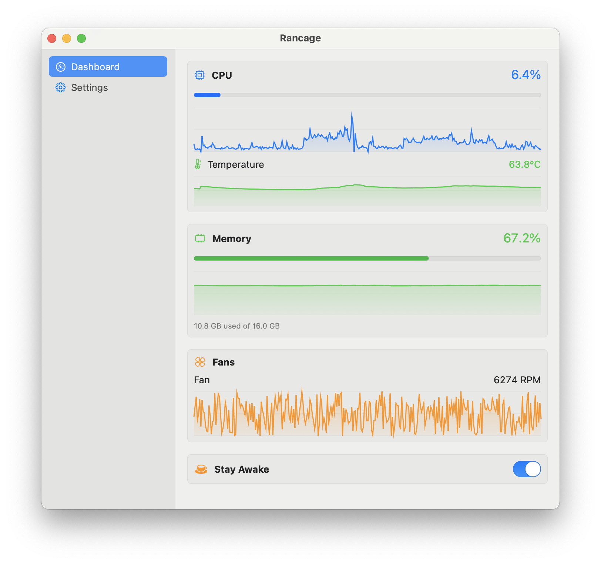

# Rancage


Native macOS menu bar app — fan monitor, temperature, resource usage, dan sleep prevention dalam satu tool ringan.

Swift + SwiftUI. No Electron. No dependencies. Cuma IOKit + AppKit.



## Features

- **Fan Speed** — Live RPM dari hardware via SMC
- **CPU Temperature** — Langsung dari SMC sensor
- **CPU Usage** — Delta-based (sama kayak Activity Monitor)
- **RAM Usage** — Active + Wired + Compressed
- **Stay Awake (Caffeine)** — Toggle prevent sleep, sync di menu bar + dashboard
- **History Graphs** — Timeline visual tiap metric
- **Menu Bar** — Configurable: icon only, text only, atau both. Fixed-width biar ngga geser-geser
- **Dashboard + Settings** — Satu window dengan sidebar (always visible, no toggle)

## Requirements

- macOS 14 (Sonoma) or later
- Intel Mac (tested on MacBook Pro 13" 2019)
- Swift 5.9+

## Build & Run

```bash
# Build dan create .app bundle
./scripts/bundle.sh

# Jalanin app
open build/Rancage.app
```

Atau langsung:

```bash
swift build
swift run
```

## Xcode

Buka `Package.swift` langsung di Xcode — standard Swift Package Manager project. No `.xcodeproj` needed.

## Configuration

Settings disimpan sebagai JSON:

```
~/.config/rancage/settings.json
```

History cache (untuk graphs):

```
~/.cache/rancage/history.json
```

### Settings Options

| Setting | Default | Description |
|---------|---------|-------------|
| showCPUInMenuBar | true | Tampilkan CPU % di menu bar |
| showCPUTempInMenuBar | true | Tampilkan suhu CPU |
| showRAMInMenuBar | true | Tampilkan RAM % |
| showFanInMenuBar | true | Tampilkan fan RPM |
| showCaffeineInMenuBar | true | Tampilkan icon caffeine saat aktif |
| menuBarStyle | both | `icon`, `text`, atau `both` |
| showDockIcon | false | Tampilkan icon di Dock |
| refreshInterval | 1.0 | Interval refresh dalam detik (1, 2, 3, 5, 10) |

## Project Structure

```
rancage/
├── Package.swift
├── assets/
│   ├── logo.png                  ← App icon 1024x1024
│   └── icons/                    ← SVG reference untuk menu bar icons
│       ├── cpu.svg
│       ├── thermometer.svg
│       ├── memory.svg
│       ├── fan.svg
│       └── caffeine.svg
├── scripts/
│   ├── bundle.sh                 ← Build + create .app bundle
│   └── generate_icon.swift       ← Regenerate app icon
└── Sources/
    ├── App/
    │   ├── main.swift
    │   └── AppDelegate.swift
    ├── Managers/
    │   ├── SMCKit.swift           ← IOKit SMC interface
    │   ├── SystemMonitor.swift    ← CPU/RAM via host_statistics
    │   └── CaffeineManager.swift  ← IOPMAssertion wrapper
    ├── Models/
    │   ├── MonitorState.swift     ← Observable state
    │   ├── SettingsManager.swift  ← JSON config persistence
    │   └── HistoryStore.swift     ← Graph data + cache
    ├── Utilities/
    │   └── MenuBarIcons.swift     ← Programmatic template icons
    └── Views/
        ├── MainWindowView.swift   ← Window with fixed sidebar
        ├── DashboardView.swift    ← Graphs + live stats
        ├── SettingsView.swift     ← All preferences
        └── MiniGraphView.swift    ← Line chart component
```

## SMC Keys (Intel Mac)

| Key | Description |
|-----|-------------|
| TC0P | CPU Proximity Temperature |
| F0Ac | Fan 0 Actual Speed (RPM) |
| FNum | Number of Fans |

## License

MIT — see [LICENSE](LICENSE)
